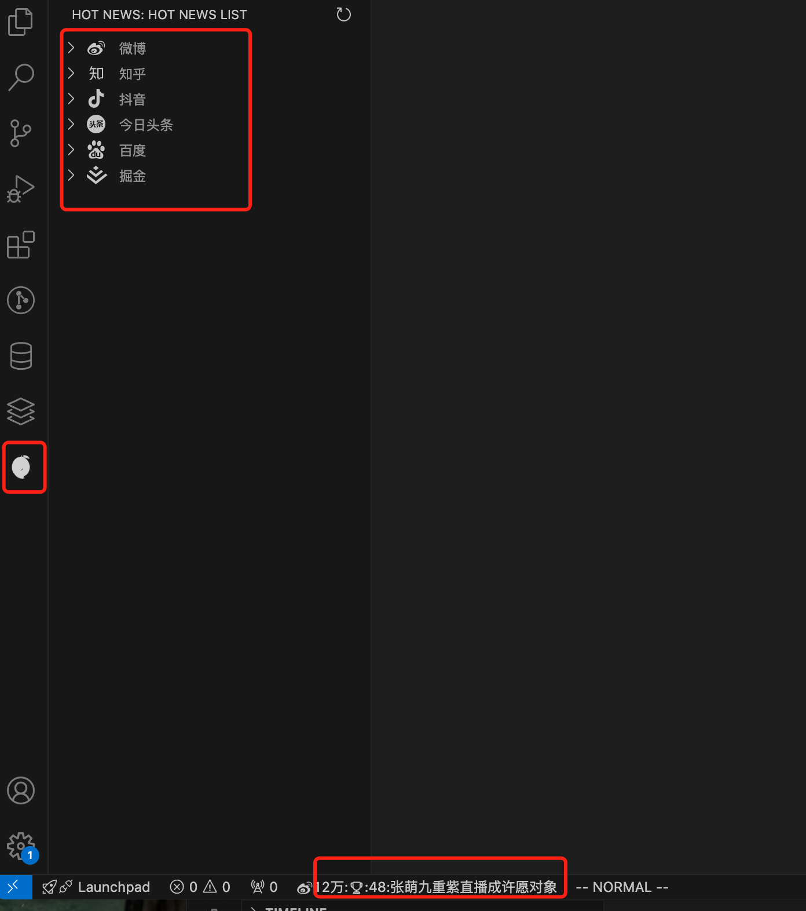
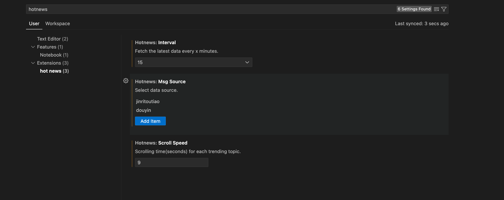
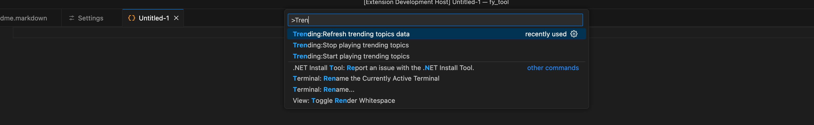

# hotNews README
"hotNews" provide the a few site hot search data, include douyinj, jinritoutiao, weibo, zhihu and more will to work out...

## Features

一旦安装完成, 状态栏底部将自动滚动显示热搜信息,activityBar 将显示列表信息, 包括抖音, 今日头条, 微博, 知乎等, 后续将会更多关于程序员的热榜更新  
格式如: weibo:热度:49万 为什么黄河没有那么黄了?  
   
鼠标点击它, 支持跳转到对应的网页  
当然, 这些数据源是可以配置的, 比如你支队微博感兴趣, 可以到设置中只选中微博数据源  

默认的是每30分钟一次去拉取网络数据, 这个也可以改, 也支持手动去拉, 执行命令: Trending:Refresh trending topics data  
如果不想它继续播放: 请执行命令: Trending:Stop playing trending topics 
当然继续播放命令是: Trending:Start playing trending topics 

## Requirements

"vscode": "^1.92.0"

## Extension Settings

This extension contributes the following settings:

* `hotnews.scrollSpeed`: the news will keep x seconds before go to next item. default 5 seconds 
* `hotnews.interval`: Fetch the latest data every x minutes. default 30 minutes
* `hotnews.msgSource`: select the data source, support multiple items
* `hotnews.position`: select display left or right(require restart or reload window)

## Known Issues

## Release Notes

Users appreciate release notes as you update your extension.

### 1.0.0

Initial first version, only a simple flow

### 1.1.0

1. add weibo and jinritoutiao data source
2. support more configuration
3. optimization data struct
4. add three commands.

### 1.2.0 (plan to do or whatever your thoughts, maybe you can email to me perfctrl@gmail.com)

1. update reademe  
2. optimization interval 

### more (plan to do or whatever your thoughts, maybe you can email to me perfctrl@gmail.com)

1. see CHANGELOG

---

**Enjoy!**
